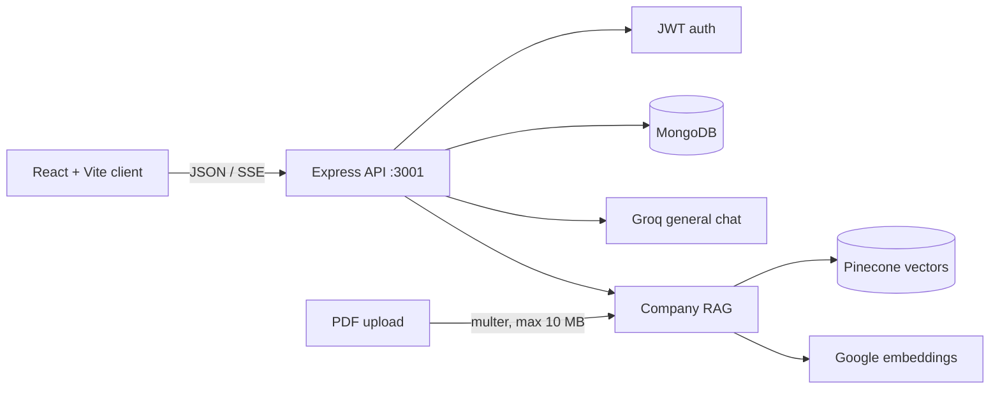
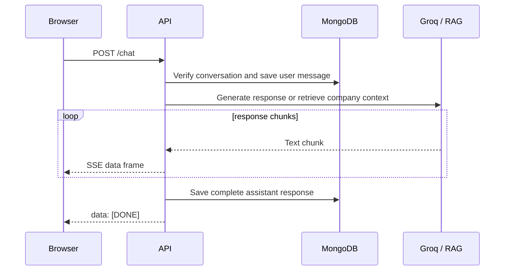

# NexusAI

NexusAI is a full-stack conversational AI workspace for everyday questions and private company knowledge. It combines a responsive React interface with a Node.js API, streamed model responses, conversation history, authentication, and PDF retrieval-augmented generation (RAG).

[](client/)
[](server/)
[](server/models/)
[](#license)

<details open>
<summary><strong>Contents</strong></summary>

- [What it does](#what-it-does)
- [Architecture](#architecture)
- [Requirements](#requirements)
- [Run locally](#run-locally)
- [Environment variables](#environment-variables)
- [Using NexusAI](#using-nexusai)
- [API reference](#api-reference)
- [Project structure](#project-structure)
- [Development](#development)
- [Security](#security)
- [Known limitations](#known-limitations)
- [License](#license)

</details>

## What it does

- **General Chat**: sends prompts to a Groq-backed language model and streams the response into the chat window.
- **Company Knowledge**: uploads PDF documents, indexes their contents in Pinecone, and answers questions using the selected document's retrieved context.
- **Conversation history**: stores conversations and messages in MongoDB and lets users reopen or delete chats.
- **Authentication**: supports sign-up, sign-in, profile loading, and sign-out with bcrypt-hashed passwords and an HTTP-only JWT cookie.
- **Responsive workspace**: includes recent chats, workspace switching, document selection, profile actions, Markdown responses, and a mobile sidebar.

## Architecture



A chat request follows this path:



## Requirements

- Node.js 18 or newer
- npm 9 or newer
- MongoDB database
- Groq API key
- Google Generative AI API key for document embeddings
- Pinecone account, API key, and an existing index

The frontend is developed with Vite. The backend and frontend are installed independently because each directory has its own `package.json`.

## Run locally

### 1. Install dependencies

From the repository root:

```bash
cd server
npm install

cd ../client
npm install
```

### 2. Configure the server

Create `server/.env` using the template below and fill in real values.

### 3. Start the API

In one terminal:

```bash
cd server
node server.js
```

The API listens on `http://localhost:3001`.

### 4. Start the client

In a second terminal:

```bash
cd client
npm run dev
```

Open the local URL printed by Vite, usually `http://localhost:5173`.

For a production-style client build:

```bash
cd client
npm run build
npm run preview
```

> The root `package.json` is not the development entry point for the current client/server layout. Run commands from `client/` or `server/` as shown above.

## Environment variables

Create `server/.env`:

```dotenv
# Persistence and authentication
MONGO_URL=mongodb://127.0.0.1:27017/nexusai
TOKEN_SECRET=replace-with-a-long-random-secret

# LLM and retrieval
GROQ_API_KEY=your-groq-api-key
GOOGLE_API_KEY=your-google-generative-ai-key
PINECONE_API_KEY=your-pinecone-api-key
PINECONE_INDEX_NAME=your-pinecone-index-name
```

Create `client/.env.local` only when the API is not running at the default local address:

```dotenv
VITE_API_BASE_URL=http://localhost:3001
```

The client defaults to `http://localhost:3001` on localhost. In non-local builds it falls back to the deployed API URL configured in `client/src/api/apiClient.js`; set `VITE_API_BASE_URL` explicitly for your own deployment.

### Pinecone index prerequisites

The server expects an existing Pinecone index. Configure its dimension and metric to match the `gemini-embedding-001` embedding setup before uploading PDFs. Uploaded files must be PDFs no larger than 10 MB.

## Using NexusAI

1. Create an account or sign in.
2. Select **General Chat** for normal questions or **Company Knowledge** for document-grounded answers.
3. Click **New chat** and send a message.
4. Upload a PDF in the company workspace and wait for indexing to finish.
5. Select the indexed document, create a company conversation, and ask questions about its contents.
6. Reopen conversations from **Recent chats** to load their saved messages.

Company responses are instructed to say `I don't know.` when the retrieved document context does not contain an answer.

## API reference

All routes are served by the backend on port `3001`.

| Method | Route | Purpose |
| --- | --- | --- |
| `POST` | `/api/auth/signUp` | Create a user and set the auth cookie |
| `POST` | `/api/auth/signIn` | Authenticate a user |
| `GET` | `/api/auth/signOut` | Clear the auth cookie |
| `GET` | `/api/auth/profile/:userId` | Load a user profile |
| `POST` | `/api/conversations` | Create a conversation |
| `GET` | `/api/conversations?userId=...&workspace=general\|company` | List conversations |
| `GET` | `/api/conversations/:conversationId/messages?userId=...` | Load messages |
| `DELETE` | `/api/conversations/:conversationId` | Delete a conversation and its messages |
| `POST` | `/api/documents/upload` | Upload and index one PDF using form field `pdf` |
| `GET` | `/api/documents` | List indexed documents |
| `POST` | `/chat` | Generate a streamed response using SSE |

### Example: create a conversation

```bash
curl -X POST http://localhost:3001/api/conversations \
  -H "Content-Type: application/json" \
  -d '{"userId":"USER_ID","title":"Product questions","workspace":"general"}'
```

### Example: upload a PDF

```bash
curl -X POST http://localhost:3001/api/documents/upload \
  -F "pdf=@./handbook.pdf"
```

### Example: send a chat message

```bash
curl -N -X POST http://localhost:3001/chat \
  -H "Content-Type: application/json" \
  -d '{"message":"Summarize this topic","userId":"USER_ID","conversationId":"CONVERSATION_ID"}'
```

The chat response is Server-Sent Events. Each chunk is sent as `data: {"text":"..."}` and the stream ends with `data: [DONE]`.

## Project structure

```text
.
├── client/
│   ├── src/
│   │   ├── api/                 API and SSE clients
│   │   ├── components/          Chat, header, sidebar, and auth UI
│   │   ├── pages/               Auth and profile pages
│   │   ├── App.jsx              Main chat experience
│   │   └── Router.jsx            Client route selection
│   └── package.json
├── server/
│   ├── config/                  MongoDB and JWT configuration
│   ├── controllers/             Auth, chat, conversation, and document handlers
│   ├── models/                  User, conversation, message, and document schemas
│   ├── Rag/                     PDF ingestion and Pinecone retrieval
│   ├── routes/                  Express route definitions
│   ├── LLM_Response.js          General chat streaming
│   ├── server.js                API entry point
│   └── package.json
└── testing/                     Local testing utilities
```

## Development

Client commands, from `client/`:

```bash
npm run dev       # Vite development server with HMR
npm run build     # Production build
npm run lint      # Oxlint checks
npm run preview   # Preview the production build
```

The backend currently has no dedicated npm scripts. Run `node server.js` from `server/` and add a test runner before relying on automated regression coverage.

## Security

- Never commit `.env` files, API keys, JWT secrets, database credentials, or uploaded documents.
- Rotate credentials immediately if they have appeared in chat, screenshots, logs, or version control. Revoke exposed Google, Groq, Gemini, and Pinecone keys from their provider dashboards.
- Use a strong random `TOKEN_SECRET` in every environment.
- Keep `secure` and appropriate `sameSite` cookie settings aligned with the HTTPS deployment origin.
- Add authorization middleware before exposing this API publicly. Several current routes accept `userId` in the request body or query string and should not rely on that value as the only authorization check.
- Validate upload ownership and document access before enabling multi-user company knowledge bases.

## Known limitations

- Authentication routes set JWT cookies, but the visible client flow also stores and sends a `userId`; server-side authorization should be strengthened before production use.
- Company document ingestion is synchronous inside the upload request and may need a background job for larger files.
- The server uses permissive CORS and a fixed port (`3001`).
- There is no root-level test command yet; `client` has lint/build commands, while the API has no automated test script.
- The RAG vector store is initialized when the server imports the retrieval module, so Pinecone and Google embedding configuration is required for the backend to start successfully.

## License

No license has been specified for this project yet.
